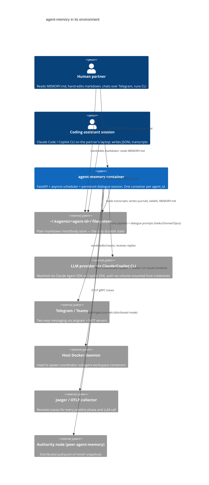

# System Context — agent-memory

**Generated:** 2026-05-15
**Git SHA:** unknown
**Audit layer:** L1 (System Context)
**Modelers:** 3 independent + 1 synthesizer

---

## What this system is

agent-memory is a long-running container that gives an AI coding assistant a persistent "mind" between sessions. It watches the assistant's session transcripts on disk, periodically distills them into dated journals, beliefs, observations, and self-assessments stored as plain markdown under `~/.kagents/<agent-id>/`, and composes a fresh `MEMORY.md` that the assistant reads at the start of each new session. The same container hosts a 24/7 dialogue agent that can message a human partner over Telegram, ask questions, and — increasingly — spawn coordinator subagents that run engineering "squads" in isolated Docker workspaces with human-in-the-loop approvals. A FastAPI service on port 7437 (driven by a thin CLI and an in-process asyncio scheduler) triggers the pipeline phases on cadence. Everything durable is plain text a human can read and edit.

---

## System Context Diagram

**Question this diagram answers:** *Who and what does the agent-memory container exchange information with during a normal day, and through which channel?*

---

## Conceptual Components

| Component | Responsibility (one line) | Roughly lives in |
|---|---|---|
| `MemoryPipeline` | Run the cadence of Collect → Consolidate → Reflect → Observe → Assess → Dedup → Prepare → Generate phases that turn transcripts into curated memory artifacts | `collection/`, `consolidation/`, `reflection/`, `observation/`, `assessment/`, `retrieval/generator.py`, orchestrated through `services.py` |
| `AgentHomeStore` | The conceptual home for the `~/.kagents/<id>/` markdown layout — but currently only the *path resolver* is centralized; writes are scattered (see Surprise 1) | `agent_home.py`, `selfwrite.py`, `state.py`, and ~40 other call sites |
| `DialogueLoop` | Drive the persistent agent persona: tick on cadence, hold a long-lived LLM session, decide whether to message the human, route replies and approvals back in | `dialogue/`, `heartbeat/`, `comm/` (telegram, teams, busy_queue, delivery, lifecycle), `scheduler.py` |
| `LLMRuntime` | Provider-agnostic seam for "structured completion" and "persistent agent session" against Claude SDK or Copilot SDK; selected via `runtime_profile` data | `runtime/protocol.py`, `runtime/generic.py`, `runtime/profiles/`, `runtime/sdk/{claude,copilot}/` |
| `SafetyGuardian` | Fail-closed taps on inbound content and outbound actions; evaluated by a separate guardian agent before the main agent acts | `guardian/taps.py`, `guardian/agent.py`, `skills/` |
| `ActionSquad` | Multi-agent action execution: define squads, cast roles, propose actions, get human approval, run them in isolated Docker workspaces | `squad/` (store, router, global_decisions_router), `workspaces/monitor.py`, `services.py:spawn_coordinator` |
| `ContainerAPI` | The FastAPI + lifespan + scheduler that exposes the system as an HTTP service, owns auth, mounts subsystem routers, and runs the in-process scheduler | `api.py`, `scheduler.py`, `config.py`, `cli.py` (thin HTTP client) |

(7 components. `MemoryService` is deliberately *not* a component — it is the venue where most of these collide; see Surprise 2.)

---

## Key Architectural Decisions (and non-decisions)

### ADR-stub-1: Filesystem-as-database under `~/.kagents/<agent-id>/`

- **Status:** Apparent — described in README, not formally recorded
- **Context:** Memory must be human-readable, hand-editable by both agent and human, portable across machines, and survive any process crash without schema migrations.
- **Apparent decision:** All durable state is markdown and JSONL on disk; no SQL/SQLite/vector store; `AgentHome` (`src/agent_memory/agent_home.py`) is the single path resolver.
- **Consequences:** Trivially portable, diff-friendly, human-auditable. Trades concurrent-write safety, transactional multi-file updates, and indexed querying for "the human can `vim` it."

### ADR-stub-2: Container is the runtime; CLI is just an HTTP client

- **Status:** Apparent — explicitly stated in README
- **Context:** Pipeline phases run on independent cadences (60 min / 24 h / 7 d / 14 d) and the dialogue loop must persist between ticks with a warm LLM session.
- **Apparent decision:** A single FastAPI + asyncio process (`api.py` + `scheduler.py`) owns a process-wide singleton `MemoryService`; `cli.py` is a thin httpx client to `localhost:7437`.
- **Consequences:** Simple deploy, persistent dialogue session possible, CLI behaves identically in dev and prod. But every CLI call needs the container running; bootstrap (auth refresh, first-time setup) requires special-cased endpoints.

### ADR-stub-3: Provider-agnostic LLM runtime, enforced by architectural invariant tests

- **Status:** Apparent and *actively defended* in CI
- **Context:** Two LLM backends (Claude Agent SDK, Copilot SDK) must be swappable without touching subsystems; team has been burned by provider branches sprinkled everywhere.
- **Apparent decision:** `runtime/protocol.py` defines `AgentRuntime` and `StructuredCompletionRuntime`; provider SDK imports are confined to `runtime/sdk/*` and `runtime/profiles/`. Hard-coded path allow-lists in `tests/architecture/test_invariants.py:1-100` (A1/A2/A3) fail CI if anyone else imports `claude_agent_sdk` or branches by provider name.
- **Consequences:** Genuine provider portability; drift caught in CI instead of review. Tells you what the team treats as load-bearing risk — and what it *doesn't* (no equivalent guard on memory writes; see Surprise 3).

### ADR-stub-4: Fail-closed safety taps between inputs/actions and the agent

- **Status:** Apparent — not formally recorded
- **Context:** The dialogue agent has agency over a Telegram channel anyone with the chat ID can write to, and can propose host-affecting actions.
- **Apparent decision:** `ContentTap` and `ActionTap` (`guardian/taps.py:1-40`) wrap inbound content and outbound actions; on guardian timeout or error, content is **blocked** and high-risk actions **denied**, with a neutral string hiding the guardian's existence.
- **Consequences:** Bounds prompt-injection blast radius and bad action proposals; pays a latency tax and risks false-positive blocks when the guardian flakes.

### ADR-stub-5 (non-decision): `MemoryService` as god-orchestrator

- **Status:** Apparent — emergent, never chosen
- **Context:** The CLI was cleanly extracted ("No Rich, Typer, or sys.exit imports" — `services.py:3`), but no further internal seams were drawn; CLI, API, and scheduler all needed pipeline triggers.
- **Apparent decision:** `MemoryService` (`services.py:202`, 2,286 lines, ~50 public methods) accreted every capability: pipeline phases (`collect/reflect/consolidate/assess/dedup/prepare/generate/audit`), dialogue (`dialogue_tick/reply/message/btw`), migration, ingest, `spawn_coordinator`, beliefs, status, busy-queue handling.
- **Consequences:** One easy DI seam for tests; everything has one obvious place to call. But each phase is now coupled to every other through shared state on `self`, and `services.py` is the de-facto architecture diagram.

---

## Surprises

### Surprise 1: There is no `MemoryStore` — file writes are scattered across ~40 files (missing abstraction)

- **Expected:** A system whose tagline is "persistent memory" should have a single seam that owns reads and writes to the memory tree, so disk layout, locking, and atomicity live in one place.
- **Observed:** `AgentHome` (`agent_home.py`) resolves *paths only* — it does not gate writes. Actual writes are scattered: `selfwrite.py`, `services.py` (≥8 distinct `write_text` call sites plus journal appends), `audit.py`, `assessment/notes.py`, `assessment/assessor.py`, `collection/writer.py`, `comm/recorder.py`, `comm/delivery.py`, `comm/queue.py`, `dialogue/btw.py`, `heartbeat/events.py`, `squad/store.py`, `retrieval/generator.py`, `preparation/engine.py`, `reflection/engine.py`, `consolidation/consolidator.py`, `state.py`, `costs/tracker.py`. A `grep -l "write_text\|\.write("` finds ~40 files writing under `~/.kagents/`. There is no `MemoryStore.write_journal(...)` / `append_belief(...)` seam, no common locking, no audit log.
- **Why it matters:** The core value prop ("the agent's mind is on disk") has no enforced choke point. Any concurrency, format, or migration concern has to be re-solved per call site — and quietly isn't. The filesystem-as-DB decision is undefended at its boundary.

### Surprise 2: A 2,286-line `MemoryService` quietly *is* the system

- **Expected:** Given the README's clean phase-per-package layout (`collection/`, `reflection/`, `consolidation/`...), each phase would be a self-contained orchestrator the API and CLI invoke directly.
- **Observed:** `services.py:202` is one class with ~50 methods spanning every pipeline phase, dialogue (`dialogue_tick/reply/message/btw`), migration (`migrate_to_mind_body`), ingest, `spawn_coordinator`, runtime factories, busy-queue draining, BtW locks, and even an `AdapterProtocol` stub (`services.py:2259-2285`). It is the *only* class FastAPI constructs.
- **Why it matters:** The package boundaries advertise modularity that the call graph doesn't honor. Refactoring or testing one capability requires holding the whole system in your head; new contributors will copy the pattern.

### Surprise 3: Architectural tests defend the LLM seam — but not the memory seam

- **Expected:** If the team writes architectural invariant tests at all, the system's central asset — the `mind/` filesystem — would be among the things they guard.
- **Observed:** `tests/architecture/test_invariants.py:1-100` documents three rules (A1/A2/A3), all about *runtime* isolation: where SDK imports may live, that the runtime factory is a pure dict lookup, that no code imports the deleted `llm/client.py`. There is no analogous invariant such as "only `MemoryStore` may write under `mind/`" — and as Surprise 1 shows, such a rule would currently fail in dozens of places.
- **Why it matters:** The presence of named, enforced invariants is excellent — but it reveals that the team treats *swapping LLM providers* as the load-bearing risk while the user-visible asset (their memories) has no equivalent guardrail.

### Surprise 4: The container is also a Docker host — quietly large blast radius

- **Expected:** A "memory" service reads files and calls an LLM.
- **Observed:** `README.md:144` documents mounting `/var/run/docker.sock` into the container; `api.py:344` exposes auth-gated `POST /coordinator/spawn`; `services.py:spawn_coordinator` (~line 1994) launches *new* containers running engineering squads with workspace dirs, `TASK.md`, and a `.coordinator-prompt.md` written from inside `MemoryService`. `squad/store.py` (911 lines), `workspaces/monitor.py` (691 lines), and `guardian/taps.py` (477 lines) are wired into the FastAPI app via `make_skills_router`, `make_squad_router`, `make_global_decisions_router` (`api.py:19-21`), and `tests/e2e/test_m5_e2e.py:34` exercises a full propose-approve-execute flow.
- **Why it matters:** The system is conceptually a "memory pipeline" but operationally a multi-agent orchestrator with docker-on-docker privileges. The L1 mental model "it just reads transcripts and writes markdown" is wrong and security-relevant. Neither `Squad` nor `Guardian` appears in the public README.

### Surprise 5: Identity and dialogue prompts are hard-coded Python strings — and the dialogue prompt duplicates `AgentHome`

- **Expected:** Prompts and agent charters live under `prompts/` or `data/` as text files loaded at runtime — the standard pattern in LLM apps and one the team already uses for skills (`data/skills/`).
- **Observed:** `agent_home.py:24-300+` hard-codes `_SHARED_VALUES_CONTENT`, `_ENGINEERING_SQUAD_CHARTER`, and per-role agent charters as triple-quoted Python strings; `dialogue/agent.py:33+` does the same for `_SYSTEM_PROMPT`; `services.py:22` imports `_COORDINATOR_SYSTEM_PROMPT` from `agent_home`. Worse: `dialogue/agent.py:44-67` embeds a literal ASCII tree of `mind/heartbeat.md`, `mind/memory/MEMORY.md`, `mind/beliefs/_index.md`, etc. as part of the LLM system prompt with a "this map is complete" instruction — duplicating `AgentHome`'s authoritative view of the same layout.
- **Why it matters:** Tuning persona requires a code change and a release; A/B'ing prompts is impossible without forking source. The duplicated directory tree will silently drift from `AgentHome` and no test will catch it.

---

## Modeler Disagreements

- **What the system fundamentally *is*.** Modeler 1 framed it as a "mind + multi-agent orchestrator with docker-on-docker privileges"; Modeler 2 framed it as a memory pipeline with safety guardrails ("squad" and "guardian" called out as undocumented subsystems); Modeler 3 explicitly flagged the project name "agent-memory" as under-selling a second system about action execution. The convergent reading — adopted here — is that "agent-memory" is a misleading name for what is now a memory pipeline *and* a multi-agent action runtime. This is itself the highest-value framing disagreement.
- **LLM seam shape.** Modeler 1 and Modeler 2 described one `LLMRuntime` seam; Modeler 3 alone observed it is *two-tier* (`AgentRuntime` for persistent sessions vs `StructuredCompletionRuntime` for one-shot JSON completions) and noted the seam leaks via `_create_structured_runtime` / `_create_btw_runtime` helpers in `services.py`. Single-modeler observation, but well-cited; worth carrying into L2.
- **Component naming for the memory tree.** Modeler 1 named the (missing) abstraction `MemoryStore`; Modeler 2 named the present-but-thin one `AgentBody`; Modeler 3 named it `AgentHomeStore`. The synthesis uses `AgentHomeStore` for what exists and `MemoryStore` for what's missing — a deliberate split that mirrors the gap.
- **"README drift" as a surprise.** Only Modeler 2 surfaced that the README's Source Layout (`README.md:370-394`) omits `comm/`, `squad/`, `guardian/`, `eval/`, `sync/`, `data/`. Not promoted to a top-5 surprise here because Surprise 4 already covers the documentation gap for `squad/` and `guardian/`, but it strengthens the "blast radius" surprise.
- **"Generate runs without an LLM" observation.** Only Modeler 3 caught that `Prepare` and `Generate` are deterministic subprocess + file-read steps (`README.md:82-83`), not LLM phases, and that the scheduler in `scheduler.py:27-33` doesn't actually run all 8 phases on cadence — Collect/Observe/Generate are triggered differently. Single-modeler observation; concrete enough to keep visible and worth re-checking at L2.
- **Component count and granularity.** Modeler 1 named 7 components heavily emphasizing the dialogue/comm/squad split; Modeler 2 named 7 with `SafetyGuardian` and `MultiAgentSquad` as peers; Modeler 3 named 7 collapsing safety + squad + workspaces into `ActionSquad`. The synthesis kept `SafetyGuardian` and `ActionSquad` separate because the fail-closed semantics of the guardian (Modeler 2's strongest contribution) are a distinct architectural decision (ADR-stub-4), not a sub-concern of squad execution.

---

**Synthesis footer**

- Modelers: 3 (all passed rejection criteria)
- Files touched (union across modelers): ~17 distinct files — `README.md`, `pyproject.toml`, `CLAUDE.md`, `src/agent_memory/services.py`, `api.py`, `scheduler.py`, `agent_home.py`, `dialogue/agent.py`, `selfwrite.py`, `retrieval/generator.py`, `runtime/__init__.py`, `runtime/protocol.py`, `squad/router.py`, `squad/store.py`, `guardian/taps.py`, `tests/architecture/test_invariants.py`, `tests/e2e/test_m5_e2e.py`
- Rejections during synthesis: 0
- Synthesizer note: All three modelers anchored hard on the *same* two findings — "MemoryService is a 2,286-line god object" and "there is no MemoryStore abstraction." That convergence is reassuring (the surprises are real and obvious from any entry point) but also suggests the modelers were drawn to whichever file was longest. The most valuable *divergent* signal came from single-modeler observations: the two-tier LLM seam (Modeler 3), the deterministic Generate phase (Modeler 3), the dialogue-prompt duplication of AgentHome (Modeler 3), and the README/source-layout drift (Modeler 2). L2 should re-examine these without anchoring on `services.py`.
