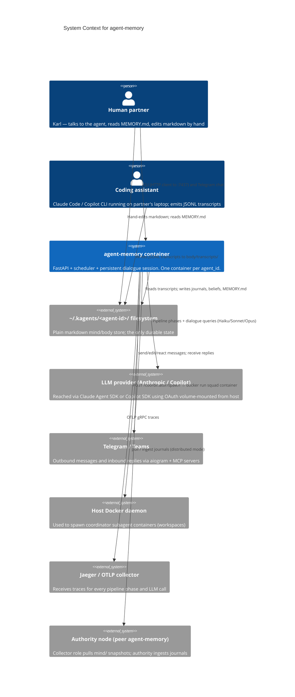

# Modeler 1 Proposal — System Context

**Target:** /Users/karl/Documents/dev/agent-memory
**Files sampled:** README.md, pyproject.toml, CLAUDE.md, src/agent_memory/services.py, src/agent_memory/api.py, src/agent_memory/agent_home.py, src/agent_memory/scheduler.py, src/agent_memory/dialogue/agent.py, src/agent_memory/squad/router.py, tests/architecture/test_invariants.py

## 1. System purpose

agent-memory is a long-running container that gives an AI coding assistant (Claude Code or GitHub Copilot) a persistent, file-based "mind." It continuously reads the assistant's session transcripts, distills them into journals, beliefs, observations, and self-assessments on a schedule, and re-composes a single `MEMORY.md` snapshot that the assistant reads at the start of every new session. The same container also hosts a 24/7 *dialogue* agent that can message a human partner over Telegram, ask questions, propose actions, and — more recently — spawn coordinator subagents that run engineering "squads" inside isolated Docker workspaces. Everything is plain markdown under `~/.kagents/<agent-id>/`, so a human can edit the agent's memory by hand.

## 2. System Context Diagram

**Question this diagram answers:** *Who and what does the agent-memory container actually talk to during a normal day?*

## 3. Conceptual Components

| Component | Responsibility (one line) | Roughly lives in |
|---|---|---|
| `MemoryStore` | Owns the on-disk shape of the agent's mind and is the only legitimate writer of agent content | `agent_home.py` (paths + seeding), but `services.py`, `selfwrite.py`, `cli.py`, `state.py` all also write directly — the abstraction leaks |
| `MemoryPipeline` | Cyclic Collect → Consolidate → Reflect → Observe → Assess → Dedup → Prepare → Generate flow that turns transcripts into beliefs and a fresh `MEMORY.md` | `services.py` (orchestration methods 1170–1900), `collection/`, `consolidation/`, `reflection/`, `assessment/`, `observation/`, `retrieval/generator.py`, `preparation/` |
| `DialogueAgent` | Long-lived persistent LLM session that ticks every 30 min, fields human replies, and decides whether to message the partner | `dialogue/agent.py`, `services.py:dialogue_tick/reply/message/btw`, `comm/` (busy queue, lifecycle, delivery) |
| `LLMRuntime` | Provider-agnostic seam for "structured completion" and "persistent agent session" against Claude SDK or Copilot SDK, plus safety hooks | `runtime/protocol.py`, `runtime/generic.py`, `runtime/sdk/{claude,copilot}.py`, `runtime/profiles/`, enforced by `tests/architecture/test_invariants.py` |
| `MessagingFabric` | Two-way conversation transport: Telegram/Teams adapters, busy-queue, quiet hours, delivery tracking, message lifecycle reactions | `comm/`, `mcp/`, `scheduler.py` (channel reload, tick wiring) |
| `SquadOrchestrator` | Defines, casts, and spawns multi-agent "squads" (coordinator + workers) in isolated Docker workspaces with their own tasks | `squad/` (router, store, models), `services.py:spawn_coordinator`, `workspaces/monitor.py`, `skills/` (action proposals, safety) |
| `ContainerRuntime` | The FastAPI app + asyncio scheduler that ties everything together, owns auth, OTEL setup, and lifespan | `api.py`, `scheduler.py`, `config.py`, `cli.py` (thin HTTP client) |

(7 components; each spans multiple packages on purpose. `services.MemoryService` is *not* a component — it is the venue where six of these collide.)

## 4. Key architectural decisions (and non-decisions)

### ADR-stub-1: Markdown filesystem is the database
- **Status:** Apparent — chosen, stated in README
- **Context:** Need state both the agent and the human can read/edit; want portability across machines and runtimes.
- **Apparent decision:** All durable state is plain text under `~/.kagents/<agent-id>/mind/` and `body/`. No SQLite, no vector DB, no embeddings index. `state.py` uses a lock file + `json.dumps`.
- **Consequences:** Trivially portable, diff-able, human-auditable. But: no transactions, every component invents its own file layout, and atomicity is per-write. Search/recall is grep + LLM context, not retrieval.

### ADR-stub-2: One container per agent, scheduler in-process
- **Status:** Apparent
- **Context:** Pipeline phases run on independent cadences (60 min / 24 h / 7 d / 14 d) and the dialogue loop must persist between ticks.
- **Apparent decision:** A single FastAPI + asyncio process (`api.py` + `scheduler.py`) owns all loops; HTTP endpoints exist to *trigger* phases manually but the in-process scheduler is canonical. The CLI is "a thin HTTP client" (README) to that container.
- **Consequences:** Simple deploy, shared in-memory `MemoryService` singleton. But the singleton (`services.py`, 2 286 lines) is now the load-bearing object for collection, dialogue, squads, and migration.

### ADR-stub-3: Provider-agnostic Runtime seam, enforced by tests
- **Status:** Apparent and *actively defended*
- **Context:** Two LLM backends (Claude Agent SDK, Copilot SDK) must be swappable via `RUNTIME=claude|copilot` without touching subsystems.
- **Apparent decision:** `runtime/protocol.py` defines `AgentRuntime`/`StructuredCompletionRuntime`; provider SDK imports are confined to `runtime/sdk/*` and policed by architectural invariant tests (`tests/architecture/test_invariants.py:89–98`) that fail CI if anyone else imports `claude_agent_sdk`.
- **Consequences:** Genuine provider portability. Strongest abstraction in the system. Tells you what the team considers load-bearing — and what it *doesn't* (no equivalent test guards memory writes).

### ADR-stub-4 (non-decision): `MemoryService` as god-orchestrator
- **Status:** Apparent — *not* recorded; emerged
- **Context:** Each pipeline phase originally lived in its own module; the CLI then needed a single entry point per endpoint.
- **Apparent decision:** All pipeline orchestration, dialogue handling, migration, squad spawning, and messaging glue accreted onto `MemoryService` (`services.py:202–2286`, ~50 public methods).
- **Consequences:** One easy DI seam for tests (`get_service()`), but the file is the de-facto architecture diagram. Adding a phase = adding a method here. No code review will refuse you on grounds of "wrong layer" because no layer is named.

### ADR-stub-5 (non-decision): Identity/charter text is hard-coded in Python
- **Status:** Apparent — not recorded
- **Context:** New agents need a default squad + shared values + agent charters at first run.
- **Apparent decision:** Multi-paragraph identity prose for squads, coders, reviewers, intent-reviewers etc. is embedded as Python string literals in `agent_home.py:24–300+`. Same for the dialogue system prompt in `dialogue/agent.py:33+`.
- **Consequences:** No template registry, no versioning of prompts independent of code, and prompts ship in wheel data only when they're under `data/skills/`. Prompt edits become source-code commits.

## 5. Surprises

### Surprise 1: There is no `MemoryStore` — writes happen in at least four files (missing abstraction)
- **Expected:** A single class (or module) is the sole writer to `mind/`. Everyone else asks it to write.
- **Observed:** `agent_home.py` seeds files; `selfwrite.py` writes notes/observations/beliefs; `services.py` writes journals, observation files, workspace `TASK.md`, and `.workspace.json`; `state.py` writes its own JSON with a separate locking scheme; `cli.py` writes config and `.env`. Examples: `services.py` has at least 8 distinct `write_text(...)` call sites (e.g., observation files, workspace metadata) and an `open("a")` journal append; `selfwrite.py` has its own append-vs-create logic; `agent_home.py:_SHARED_VALUES_CONTENT` writes identity files. No common locking, no common audit log.
- **Why it matters:** The system's most-cited value prop ("the agent's mind is on disk") has no enforced choke point — corruption, concurrent writes, or schema drift cannot be prevented or even reliably traced.

### Surprise 2: A 2 286-line `MemoryService` quietly is the system
- **Expected:** With 27 subpackages, orchestration is split per concern (a `PipelineRunner`, a `DialogueOrchestrator`, a `SquadDispatcher`).
- **Observed:** `src/agent_memory/services.py` is 2 286 lines and ~50 public methods covering pipeline phases (`collect`, `reflect`, `consolidate`, `assess`, `audit`), dialogue (`dialogue_tick/reply/message/btw`), migration (`migrate`, `migrate_to_mind_body`), squad spawning (`spawn_coordinator`), runtime factories, busy-queue handling, and even an `AdapterProtocol` stub (`services.py:2259–2285`). It is the *only* class FastAPI constructs.
- **Why it matters:** Every conceptual component routes through one file. Refactoring or testing a single capability cannot be done without holding the whole system in your head; new contributors will copy the pattern.

### Surprise 3: Architectural tests defend the LLM seam but not the memory seam
- **Expected:** If the team writes architectural invariant tests at all, the system's central asset — the mind/ filesystem — is among them.
- **Observed:** `tests/architecture/test_invariants.py:1–100` documents three rules (A1/A2/A3) all about *runtime* isolation: where SDK imports may live, that the runtime factory is a pure dict lookup, that no code imports the deleted `llm/client.py`. There is no analogous invariant like "only `MemoryStore` may write under `mind/`", and as Surprise 1 shows, such a rule would currently fail.
- **Why it matters:** The presence of named, enforced invariants is great — but it tells us the team treats *swapping LLMs* as the load-bearing risk, while the actual user-visible asset (their memories) has no equivalent guardrail.

### Surprise 4: The container is also a Docker host (a quietly large blast radius)
- **Expected:** A "memory" service reads files and calls an LLM.
- **Observed:** `README.md:144` documents mounting `/var/run/docker.sock` into the container, and `api.py:344` exposes `POST /coordinator/spawn` (auth-gated) which `services.py:spawn_coordinator` (~line 1994) uses to launch *new* containers running engineering squads with workspace dirs, `TASK.md`, and a `.coordinator-prompt.md` written from inside the same `MemoryService`.
- **Why it matters:** The system is conceptually a "memory pipeline" but operationally a multi-agent orchestrator with docker-on-docker privileges. The L1 mental model "it just reads transcripts and writes markdown" is wrong, and security-relevant.

### Surprise 5: Prompts and identity are versioned with the wheel, not as data
- **Expected:** Prompts and agent charters live under `prompts/` or `data/` as text files, loaded at runtime; this is the standard pattern in LLM apps.
- **Observed:** `agent_home.py:24–80+` hard-codes `_SHARED_VALUES_CONTENT`, `_ENGINEERING_SQUAD_CHARTER`, and per-agent `_ENGINEERING_AGENT_CHARTERS` (coder/reviewer/intent-reviewer/...) as Python triple-quoted strings; `dialogue/agent.py:33+` does the same for `_SYSTEM_PROMPT`; `services.py:22` imports `_COORDINATOR_SYSTEM_PROMPT` from `agent_home`. There is a `prompts/` package and a `data/skills/` directory, so the team *knows* the externalization pattern — but identity text never made it there.
- **Why it matters:** Tuning the agent's persona requires a code change and a release; A/B'ing prompts is impossible without forking the source.
