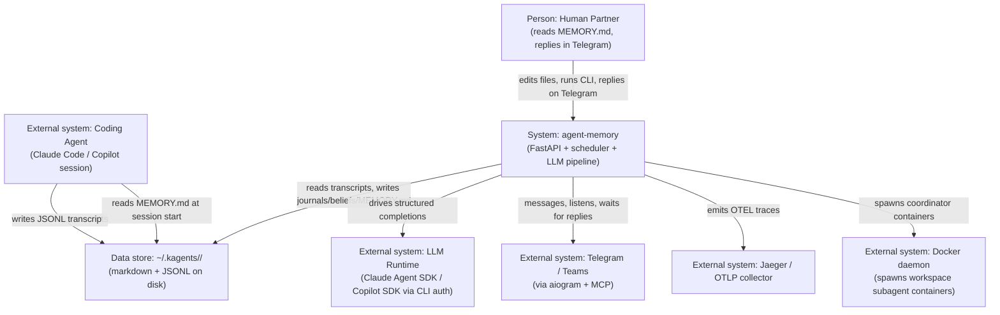

# Modeler 2 Proposal — System Context

**Target:** `/Users/karl/Documents/dev/agent-memory`
**Files sampled:** `README.md`, `CLAUDE.md`, `pyproject.toml`, `src/agent_memory/services.py`, `src/agent_memory/api.py`, `src/agent_memory/scheduler.py`, `src/agent_memory/dialogue/agent.py`, `src/agent_memory/squad/store.py`, `src/agent_memory/guardian/taps.py`, `tests/architecture/test_invariants.py`

## 1. System purpose

agent-memory is a long-running container that gives an AI coding agent a *mind*: it watches the agent's session transcripts, distills them into dated journals, periodically reflects on them to form beliefs and questions, composes a fresh `MEMORY.md` before each session, and can hold an ongoing conversation with the human via Telegram between sessions. All state is plain markdown and JSONL under `~/.kagents/<agent-id>/`, so the human and the agent can both read and edit it. A REST API on port 7437 (driven by a thin CLI and an internal scheduler) triggers the pipeline phases on a cron, while a persistent LLM session lets the agent ask questions, propose actions, and remember context across ticks without a cold start.

## 2. System Context Diagram

**Question this diagram answers:** *Who and what does agent-memory exchange information with, and along which channel?*

## 3. Conceptual Components

| Component | Responsibility (one line) | Roughly lives in |
|---|---|---|
| `PipelineOrchestrator` | Decides what runs when (collect/reflect/consolidate/assess/dedup/prepare/generate) and executes one phase end-to-end | `services.py` (the `MemoryService` god-object) + `scheduler.py` |
| `AgentMind` | Reads transcripts, distills them into journals, reflects into beliefs, consolidates over time, audits quality | `collection/`, `reflection/`, `consolidation/`, `assessment/`, `observation/`, `beliefs/`, `retrieval/generator.py` |
| `AgentBody` (filesystem-as-DB) | Owns the `~/.kagents/<id>/` layout and is the only abstraction that knows where any piece of state lives on disk | `agent_home.py` (path resolver) + every module that calls `home.something_dir` |
| `LLMRuntime` | Hides the per-provider SDK and offers a uniform `complete_structured` + persistent-session interface to the rest of the system | `runtime/` (protocol + profiles + sdk/{claude,copilot}) + `llm/` (schemas, retry) |
| `DialogueLoop` | Runs the autonomous tick, holds a long-lived agent session, decides whether to message the human, processes replies, queues messages when busy | `dialogue/`, `heartbeat/`, `comm/` (telegram, teams, lifecycle, busy_queue, delivery) |
| `SafetyGuardian` | Evaluates inbound content and outbound actions through a separate guardian agent; fail-closed gate before the main agent or before action execution | `guardian/taps.py`, `guardian/agent.py`, `skills/` (action proposals + safety guard) |
| `MultiAgentSquad` | Manages named squads of agents, their charters, an append-only decision ledger, and casting policy | `squad/store.py`, `squad/router.py`, `squad/global_decisions_router.py` |

## 4. Key architectural decisions (and non-decisions)

### ADR-stub-1: Filesystem-as-database under `~/.kagents/<agent-id>/`

- **Status:** Apparent — not formally recorded
- **Context:** Memory must be human-readable, human-editable, portable across machines, and survive any process crash without migrations.
- **Apparent decision:** All long-lived state is markdown and JSONL on disk under a single agent-rooted tree. There is no SQL/SQLite/Redis. `AgentHome` (`src/agent_memory/agent_home.py`) is the single path resolver.
- **Consequences:** Enables the human-in-the-loop core promise; eliminates schema migrations; trades concurrent-write safety, indexed querying, and atomic multi-file updates for "the human can `vim` it".

### ADR-stub-2: Container is the runtime; CLI is just an HTTP client

- **Status:** Apparent — explicitly described in README
- **Context:** Pipeline phases are long-running, scheduled, and need to share an in-memory `MemoryService` (LLM clients, persistent dialogue session, busy queue). A pure CLI can't.
- **Apparent decision:** `FastAPI` app in `api.py` owns a process-wide singleton `MemoryService`; `cli.py` is a thin httpx client to `localhost:7437` (`pyproject.toml`, `README.md:191`).
- **Consequences:** Persistent dialogue sessions become possible; the CLI works the same in dev and prod; but every CLI invocation needs the container running, which is a steep "first 5 minutes" cliff.

### ADR-stub-3: Provider-agnostic runtime with architectural test enforcement (**non-decision turned decision**)

- **Status:** Apparent — emergent, then formalized
- **Context:** Two LLM providers (Claude SDK, Copilot SDK) and the temptation to sprinkle provider-specific branches everywhere.
- **Apparent decision:** A single `StructuredCompletionRuntime` protocol; per-provider classes confined to `runtime/sdk/` and `runtime/profiles/`; carve-outs are a hard-coded list policed by `tests/architecture/test_invariants.py` (e.g., `CLAUDE_SDK_ALLOWED_PATHS`, `test_a1_no_llm_client_imports`).
- **Consequences:** Provider swaps stay cheap; architecture drift is caught in CI rather than in review; the cost is real ceremony — adding a new SDK entrypoint requires editing both code and the invariant list.

### ADR-stub-4: Fail-closed safety taps between inputs and the agent

- **Status:** Apparent — not formally recorded
- **Context:** The dialogue agent has agency (sends messages, proposes actions) over a Telegram channel anyone with the chat ID can write to.
- **Apparent decision:** `ContentTap` and `ActionTap` (`src/agent_memory/guardian/taps.py:1-40`) wrap inbound content and outbound actions. On guardian timeout or error, content is **blocked** and high-risk actions are **denied**, returning a neutral string that hides the guardian's existence.
- **Consequences:** Bounds the blast radius of prompt-injection in incoming messages and bad action proposals; pays a latency tax on every message and risks false-positive blocks when the guardian flakes.

### ADR-stub-5: One service object owns the business logic — **non-decision**

- **Status:** Apparent — non-decision (emerged without being chosen)
- **Context:** The CLI needed pipeline triggers; the API needed pipeline triggers; the scheduler needed pipeline triggers. The path of least resistance is one class everyone calls.
- **Apparent decision:** `MemoryService` in `src/agent_memory/services.py` (2,286 lines, ~50 methods, 14 result dataclasses) is the single entrypoint for *every* phase, dialogue, migration, ingest, and even `spawn_coordinator`.
- **Consequences:** Easy to wire; everything has one obvious place to call. But each phase is now coupled to every other phase through shared state on `self`, and `services.py` is the largest, hardest-to-reason-about file in the codebase.

## 5. Surprises

### Surprise 1: `MemoryService` is the unacknowledged god-object

- **Expected:** Given the README's clean phase-per-package layout (`collection/`, `reflection/`, `consolidation/`...), I expected each phase to be a self-contained orchestrator that the API and CLI invoke directly.
- **Observed:** `src/agent_memory/services.py` is 2,286 lines and exposes `collect`, `reflect`, `consolidate`, `assess`, `dedup`, `prepare`, `generate`, `audit`, `dialogue_tick`, `dialogue_reply`, `dialogue_message`, `dialogue_btw`, `migrate`, `migrate_to_mind_body`, `ingest`, `spawn_coordinator`, `status`, `beliefs`, `seed_container_memory`, `create_mind_snapshot`, `prepare_active_projects`, plus a busy-queue drainer and a BtW lock — all on one class (`services.py:202`, methods listed `services.py:255-2219`).
- **Why it matters:** The package boundaries advertise modularity that the call graph doesn't honour; the real architecture is "everything is a method on `MemoryService`".

### Surprise 2: There is no `MemoryStore` abstraction — *missing abstraction*

- **Expected:** A system whose tagline is "persistent memory" should have a single seam that owns reads and writes to the memory tree, so that disk layout, locking, and atomicity live in one place.
- **Observed:** `AgentHome` (`src/agent_memory/agent_home.py`, 1,307 lines) only resolves *paths*. Actual writes to memory state are scattered: `selfwrite.py`, `services.py`, `audit.py`, `assessment/notes.py`, `dialogue/btw.py`, `heartbeat/events.py`, `squad/store.py`, `retrieval/generator.py`, `preparation/engine.py`, `reflection/engine.py`, `consolidation/consolidator.py` all open or write under `~/.kagents/` directly (per `grep -l AgentHome` and direct `write_text` usage). There is no `MemoryStore.write_journal(...)` / `MemoryStore.append_belief(...)` seam.
- **Why it matters:** Any concurrency, format, or migration concern has to be solved in N files; the file-system-as-DB decision is undefended at its boundary.

### Surprise 3: README source layout has drifted from reality

- **Expected:** `README.md`'s "Source Layout" section (lines 370-394) is the canonical map of the codebase.
- **Observed:** The on-disk `src/agent_memory/` contains `comm/`, `squad/`, `guardian/`, `eval/`, `sync/`, `data/` — none of which appear in the README. `comm/` alone has 13 files (`adapter.py`, `busy_queue.py`, `delivery.py`, `formatter.py`, `lifecycle.py`, `queue.py`, `recorder.py`, `response.py`, `router.py`, `teams.py`, `telegram.py`), and `squad/store.py` is the 6th-largest file in the codebase (911 LOC).
- **Why it matters:** New contributors (and future Claude sessions) are silently mis-oriented — the doc says "Telegram lives in `mcp/`" but the heavy lifting is in a `comm/` package the doc has never heard of.

### Surprise 4: Architecture is enforced *by tests*, not by structure

- **Expected:** Provider isolation enforced through Python's normal mechanisms — narrow imports, dependency injection, package privacy.
- **Observed:** `tests/architecture/test_invariants.py:1-100` is the actual policy. SDK isolation, "no `llm/client.py` imports", "no provider branching in `get_structured_runtime`", and the legitimate carve-outs are encoded as **hard-coded path allow-lists** in a test module, with an explicit comment that later milestones will append to these lists.
- **Why it matters:** This is unusual and clever — architecture lives in CI rather than convention — but it means the "architecture document" is a `.py` file most readers will never open, and rules can be silently changed by editing an allow-list.

### Surprise 5: `Squad` and `Guardian` are first-class subsystems the public README never mentions

- **Expected:** README's component list is the public surface.
- **Observed:** `squad/` (multi-agent ledger with `SquadStore` at `src/agent_memory/squad/store.py:67`, plus a router mounted in `api.py:20-21`) and `guardian/` (content + action taps with fail-closed semantics, `src/agent_memory/guardian/taps.py:1-40`) are wired straight into the FastAPI app and the dialogue path — yet neither appears in the README, the CLI reference, or `CLAUDE.md`.
- **Why it matters:** These are load-bearing subsystems (the squad router exposes its own auth surface; the guardian gates every inbound message), so undocumented presence is a real onboarding and security-review hazard.
