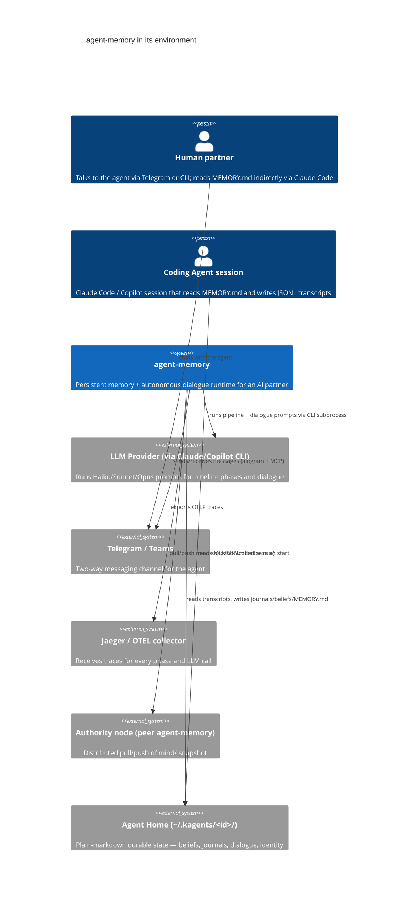

# Modeler 3 Proposal — System Context

**Target:** /Users/karl/Documents/dev/agent-memory
**Files sampled:** README.md, pyproject.toml, src/agent_memory/api.py, src/agent_memory/services.py, src/agent_memory/scheduler.py, src/agent_memory/agent_home.py, src/agent_memory/dialogue/agent.py, src/agent_memory/selfwrite.py, src/agent_memory/retrieval/generator.py, src/agent_memory/runtime/__init__.py, tests/e2e/test_m5_e2e.py

## 1. System purpose

agent-memory is a long-running container that gives an AI coding agent a *life* between sessions. It watches the agent's session transcripts, periodically distills them into journals, reflections, beliefs, and self-assessments stored as plain markdown under `~/.kagents/<agent-id>/`, and composes a fresh `MEMORY.md` for the agent to read at the start of each new session. Beyond passive memory, it also drives a persistent two-way dialogue loop — the agent ticks on a schedule, can decide to reach out to its human partner over Telegram, ask questions, propose actions for approval, and execute them. A FastAPI service on port 7437 exposes both pipeline triggers and dialogue endpoints; an asyncio scheduler runs the phases on cadence; a swappable runtime profile picks between Claude CLI and GitHub Copilot CLI as the underlying LLM driver.

## 2. System Context Diagram

**Question this diagram answers:** *Who or what feeds this system, and where does its output go?*

## 3. Conceptual Components

| Component | Responsibility (one line) | Roughly lives in |
|---|---|---|
| `MemoryPipeline` | Run the cadence of Collect → Consolidate → Reflect → Observe → Assess → Dedup → Generate phases that turn raw transcripts into curated memory artifacts. | `collection/`, `consolidation/`, `reflection/`, `observation/`, `assessment/`, `retrieval/generator.py`, orchestrated through `services.py` |
| `AgentHomeStore` | Own the on-disk layout of `~/.kagents/<id>/` (journals, beliefs, dialogue, identity) and resolve every path the rest of the system reads or writes. | `agent_home.py`, `selfwrite.py`, `beliefs/`, `state.py` |
| `DialogueLoop` | Drive the persistent agent persona: gather events, hold a long-lived LLM session, decide whether to message the human, route replies and approvals back in. | `dialogue/`, `heartbeat/`, `scheduler.py` (tick scheduling), `comm/router.py` |
| `LLMRuntime` | Abstract over Claude CLI vs Copilot CLI (and structured-completion vs persistent-session shapes) behind one protocol selected by runtime profile. | `runtime/protocol.py`, `runtime/generic.py`, `runtime/profiles/`, `runtime/sdk/` |
| `CommGateway` | Bridge the agent to outside humans: Telegram/Teams adapters, message queue, delivery tracking, approval callbacks, quiet hours. | `comm/`, `mcp/telegram_stdio.py`, `mcp/teams_stdio.py` |
| `ContainerAPI` | Expose the system as an HTTP service: auth, phase triggers, dialogue endpoints, status/health, auth-token refresh, squad routers. | `api.py`, `cli.py` (thin HTTP client), `scheduler.py` lifespan |
| `ActionSquad` | Let the agent propose actions, get human approval, run them safely, and farm out delegated work to sub-agents. | `skills/`, `squad/`, `guardian/`, `workspaces/` |

## 4. Key architectural decisions (and non-decisions)

### ADR-stub-1: Plain markdown files under `~/.kagents/<agent-id>/` as the only durable store
- **Status:** Apparent — not formally recorded
- **Context:** Memory must be human-readable, hand-editable, portable across machines, and shareable with the coding agent without a query language.
- **Apparent decision:** No database. Every long-lived artifact is a markdown or JSONL file on disk; `AgentHome` is the single path resolver.
- **Consequences:** Trivially debuggable, diff-friendly, portable; but no transactional writes, no concurrent-writer safety, no indexing, and "find all writers" is a grep across 41 files (see Surprise 1).

### ADR-stub-2: Two-tier LLM seam — `AgentRuntime` vs `StructuredCompletionRuntime`
- **Status:** Apparent — partially formal (referenced in ARCHITECTURE.md §3)
- **Context:** Some phases need a single JSON-shaped completion (Reflect, Dedup); the dialogue loop needs a persistent multi-turn session.
- **Apparent decision:** Two protocols in `runtime/protocol.py`, both selected via a `runtime_profile` registry; provider (claude/copilot) is data, not code (`runtime/profiles/`).
- **Consequences:** Adding a provider is a profile file, not new code paths; but consumers must know which of the two shapes they need, and the seam leaks (e.g., `services.py` has separate `_create_structured_runtime` and `_create_btw_runtime` helpers).

### ADR-stub-3: Scheduler-as-orchestrator co-located with the API process
- **Status:** Apparent — not formally recorded
- **Context:** Both periodic memory work and a persistent dialogue session need to live somewhere; an external cron + agent loop would multiply moving parts.
- **Apparent decision:** A single asyncio `MemoryScheduler` runs inside the FastAPI lifespan, owns the long-lived dialogue agent, and exposes the same phases via HTTP for on-demand triggers.
- **Consequences:** One container = the whole runtime; simple ops, but scheduler concerns (delays, maintenance.json, approvals, workspace monitor) bleed into a 1.7k-line file (`scheduler.py`).

### ADR-stub-4 (**non-decision**): `MemoryService` as the de-facto god object
- **Status:** Emergent — never chosen
- **Context:** The CLI was split off cleanly ("No Rich, Typer, or sys.exit imports" — `services.py:3`), but no further internal seams were drawn.
- **Apparent decision:** Every capability — migration, ingest, generate, prepare, dialogue tick, beliefs, status — accreted as another method on `MemoryService` (2,286 lines, ~34 methods).
- **Consequences:** One import gets you everything; but every new capability is a new method on the same class, and unit-testing in isolation requires constructing a near-full Config.

### ADR-stub-5: Container is the unit of deployment; CLI is just an HTTP client
- **Status:** Apparent — documented in README
- **Context:** The pipeline needs to run continuously and own long-lived state (transcripts watcher, dialogue session); CLI commands need to be invocable from anywhere.
- **Apparent decision:** `agent-memory <cmd>` is a typer CLI that POSTs to `localhost:7437`; all real work happens inside the container; auth via `AGENT_MEMORY_AUTH_TOKEN`; Claude CLI auth is delivered through a Docker volume mount.
- **Consequences:** Single source of truth for runtime state; but every CLI call requires a running container, and bootstrapping (auth refresh, first-time setup) needs special-cased endpoints (`/auth/refresh`).

## 5. Surprises

### Surprise 1: There is no `MemoryStore` — file writes are scattered across 41 files
- **Expected:** A single "store" abstraction owning all writes to `~/.kagents/<id>/`, with `AgentHome` resolving paths and a thin writer enforcing invariants (UTF-8, atomic replace, locking).
- **Observed:** `grep -l "write_text\|\.write(" src/agent_memory/**/*.py` returns 41 files. `selfwrite.py:1` defines a "self-authored memory" writer but only for 5 categories; meanwhile `assessment/assessor.py`, `assessment/notes.py`, `collection/writer.py`, `comm/recorder.py`, `comm/delivery.py`, `comm/queue.py`, `costs/tracker.py`, `observability/exporter.py`, `state.py`, etc. all write directly. `agent_home.py:1` advertises itself as the path resolver but doesn't gate the writes.
- **Why it matters:** Any invariant on Agent Home state (atomicity, schema, locking, audit) has to be re-implemented per call site — and quietly isn't. This is the missing abstraction.

### Surprise 2: `MemoryService` is a 2,286-line god object explicitly created to *avoid* a god object
- **Expected:** The docstring at `services.py:1` ("Service layer — business logic extracted from CLI… Pure data in, structured results out.") suggests a thin orchestration layer over domain services.
- **Observed:** `services.py:202` is one class with ~34 methods spanning migration, mind/body, ingest, dialogue tick, belief surfacing, observations, generation, status, telegram message lookup. `api.py` and `scheduler.py` both depend on it for nearly everything.
- **Why it matters:** The "extract from CLI" refactor moved the problem rather than dissolved it. Adding a new capability has only one obvious home, so the file keeps growing — the architecture has no other gravity well.

### Surprise 3: The pipeline diagram shows 8 phases; only some are actually run by the scheduler, and "Generate" runs without an LLM
- **Expected:** From README's pipeline table, all 8 phases (Collect, Consolidate, Reflect, Observe, Assess, Dedup, Prepare, Generate) are scheduled LLM-driven steps.
- **Observed:** README §"Pipeline Phases" footnotes that Prepare and Generate are "No LLM. Pure subprocess + file reads" (`README.md:82-83`). `scheduler.py:27-33` declares pipeline keys only for reflect, consolidate, assess, prepare, dedup — Collect, Observe, Generate live on different schedules or triggers. The mental model of "8 LLM phases on cron" is wrong.
- **Why it matters:** The conceptual model in the README is the contract for new contributors; the actual model has a deterministic Generate phase that is the hottest path (it produces `MEMORY.md`) and is invoked as a side effect of Collect/Prepare. A reader will look for an LLM call that isn't there.

### Surprise 4: The "dialogue agent" has its own system prompt that tells the LLM the directory layout — duplicating `agent_home.py`
- **Expected:** One source of truth for the home directory layout — either `AgentHome` in code, or one canonical doc the agent reads.
- **Observed:** `dialogue/agent.py:44-67` embeds a literal ASCII tree of `mind/heartbeat.md`, `mind/memory/MEMORY.md`, `mind/beliefs/_index.md`, etc. as part of the LLM system prompt, with a "this map is complete" instruction telling the agent not to `ls`. `agent_home.py` has its own authoritative view of the same layout.
- **Why it matters:** The two will drift. If `AgentHome` adds a path, the dialogue agent won't see it unless someone remembers to update a string constant in a 823-line file. This is a content-vs-code duplication that no test will catch.

### Surprise 5: `squad/`, `guardian/`, `workspaces/`, `skills/` — a whole second system about *multi-agent action execution* lives next to the memory pipeline
- **Expected:** Given the name "agent-memory", the core is memory; "actions" might be a thin extension.
- **Observed:** `api.py:19-21` mounts `make_skills_router`, `make_squad_router`, `make_global_decisions_router`. `squad/store.py` is 911 lines; `workspaces/monitor.py` is 691 lines; `guardian/taps.py` is 477 lines. Test `tests/e2e/test_m5_e2e.py:34` exercises a full propose-approve-execute flow with `ActionExecutor`, `SafetyGuard`, and `ReplyRouter`. This is a coordinator/squad runtime, not a memory adjunct.
- **Why it matters:** The project name and README under-sell what the system actually is. A reader expecting "memory utility" will be surprised to find a multi-agent orchestrator with safety gates and approval callbacks — and may not look there for bugs that present as "memory" issues.
