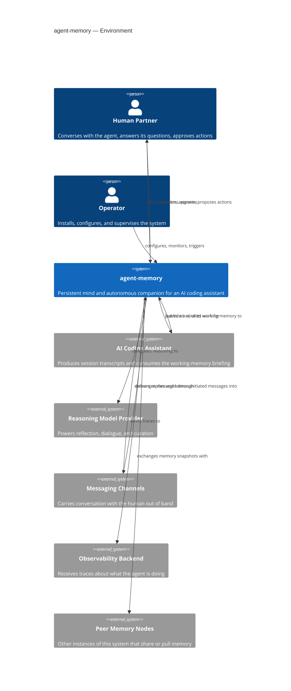
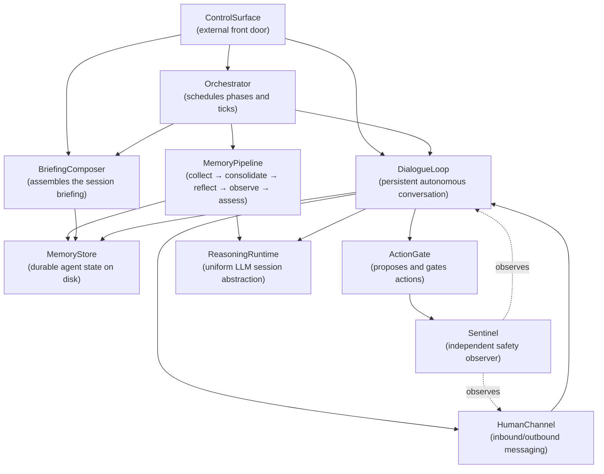

# System Context — agent-memory

**Generated:** 2026-05-15
**Git SHA:** unknown
**Audit layer:** L1 (System Context — description)
**Modelers:** 3 independent + 1 synthesizer

> This is a **pure description** of what the system does. Findings (problems, missing abstractions, god objects, security concerns) live in `FINDINGS.md` alongside this file.

---

## What this system does

agent-memory is a long-running companion service that gives an AI coding assistant a durable mind across sessions. It watches the work the assistant does over time, distills those sessions into journals, reflections, beliefs, observations, and self-assessments, and composes a concise working-memory briefing the assistant reads at the start of every new task. Alongside that reflection loop, it hosts an autonomous dialogue partner that converses with the human between tasks — asking questions, surfacing observations, proposing actions, and requesting approval before acting — while an independent observer keeps watch over what the agent is being told and what it is about to do. Everything the agent "remembers" is stored as human-readable files in an agent-home directory so both the human and the agent can read and edit the same knowledge base.

---

## Environment Diagram

**Question this diagram answers:** Who and what does agent-memory interact with in its environment?

---

## Conceptual Structure Diagram

**Question this diagram answers:** What are agent-memory's main internal parts and how do they relate?

---

## Conceptual Components

| Component | Responsibility (one line) | Roughly lives in |
|---|---|---|
| `ControlSurface` | Exposes the system's capabilities to humans and tools via HTTP and a CLI | `src/agent_memory/api.py`, `src/agent_memory/cli.py` |
| `Orchestrator` | Decides when each pipeline phase and dialogue tick runs and wires the rest together | `src/agent_memory/scheduler.py`, `src/agent_memory/services.py` |
| `MemoryPipeline` | Turns raw work traces into journals, summaries, beliefs, observations, and self-assessments | `collection/`, `consolidation/`, `reflection/`, `observation/`, `assessment/`, `beliefs/` |
| `BriefingComposer` | Assembles the bounded, priority-ranked working-memory snapshot the assistant reads at session start | `src/agent_memory/retrieval/`, `src/agent_memory/preparation/` |
| `MemoryStore` | Owns the on-disk agent-home layout and serves reads/writes of journals, beliefs, identity, dialogue state | `src/agent_memory/agent_home.py`, on-disk agent home directory |
| `DialogueLoop` | Maintains the persistent autonomous conversation with the human between ticks | `src/agent_memory/dialogue/`, `src/agent_memory/heartbeat/` |
| `HumanChannel` | Carries messages between the agent and the human across chat channels | `src/agent_memory/comm/`, `src/agent_memory/mcp/` |
| `ActionGate` | Catalogs actions the agent may take and gates their execution behind proposal and approval | `src/agent_memory/skills/` |
| `ReasoningRuntime` | Abstracts the underlying language-model session lifecycle behind a uniform contract | `src/agent_memory/runtime/`, `src/agent_memory/llm/` |
| `Sentinel` | Independently observes content and proposed actions for safety, gating or escalating when needed | `src/agent_memory/guardian/` |

> 10 components — at the high end of the 4–7 guideline. The synthesizer kept the finer split because two modelers independently surfaced `BriefingComposer`, `ActionGate`, and `Sentinel` as distinct from the broader `MemoryPipeline` / `DialogueLoop` / safety story, and collapsing them loses real conceptual seams. Flagged in disagreements below.

---

## Modeler Disagreements

- **What the system fundamentally is.** All three converged on "durable mind + autonomous dialogue + safety observer", but Modeler 1 framed it as *memory infrastructure with a dialogue agent attached*, while Modelers 2 and 3 framed it as *a companion service whose two equal halves are reflection and dialogue*. The synthesizer adopted the 2/3 framing — the dialogue loop is not subordinate to the memory pipeline in the code.
- **Granularity of internal structure.** Modeler 1 collapsed to 7 components (rolling briefing assembly into `MemoryPipeline`, action proposal into `DialogueEngine`, and safety into a single `GuardianSentinel` covering both observation and gating). Modelers 2 and 3 split these out (`BriefingComposer`, `ActionGate`, `Sentinel`). Majority view kept the split; the resulting 10-component list is acknowledged as over the target.
- **Action proposal vs. safety.** Modelers 2 and 3 separate `ActionGate` (proposes/executes) from `Sentinel` (independently observes). Modeler 1 fused them into `GuardianSentinel`. Code evidence (a 12-module `guardian/` package distinct from `skills/`) favours the split.
- **Naming of the conversational surface.** `CommunicationGateway` (M1) vs. `HumanChannel` (M2) vs. `Conversation` / `ConversationGateway` (M3) — same component, three names. Chose `HumanChannel` for being the most conceptual (describes the role, not the mechanism).
- **Single-modeler environment actors.** Modeler 2 included "Project Workspaces" as a source of work signals; Modeler 3 included "Secret Vault". Neither earned consensus and both leak toward implementation — dropped from the environment diagram. Modeler 1's "Coding Agent Sessions" was generalised into the consensus `AI Coding Assistant`.
- **Operator persona.** Only Modeler 1 named an `Operator` distinct from the `Human Partner`. The synthesizer kept it because configuration/supervision is a meaningfully different role from conversational partnership, even if the same human plays both.

---

**Synthesis footer**

- Modelers: 3
- Files touched (union across modelers): ~14 (README, pyproject, services.py, api.py, scheduler.py, agent_home.py, dialogue/agent.py, comm/router.py, guardian/agent.py, retrieval/generator.py, squad/router.py, skills/router.py, collection/, retrieval/)
- Rejections during synthesis: 0
- Findings catalogued: 9 — see `FINDINGS.md`
- Synthesizer note: Strong convergence on the existence and shape of a god-class (`services.py`) and on doc/code drift around the agent-home config path — both raised independently by all three modelers, which gives the L2 deep-dive a clear starting target.
