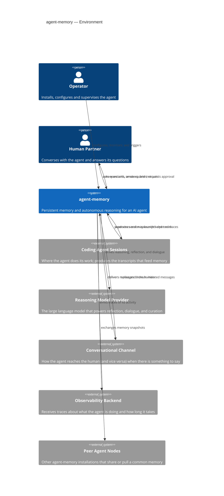
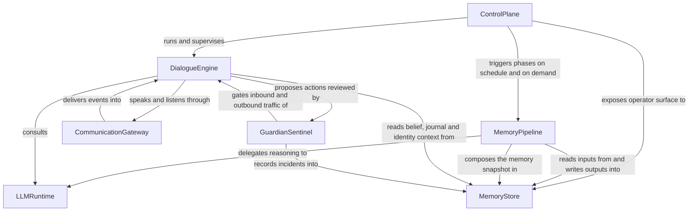

# Modeler 1 Proposal — System Context

**Target:** /Users/karl/Documents/dev/agent-memory
**Files sampled:** README.md, pyproject.toml, src/agent_memory/services.py, src/agent_memory/api.py, src/agent_memory/scheduler.py, src/agent_memory/dialogue/agent.py, src/agent_memory/comm/router.py, src/agent_memory/retrieval/generator.py, src/agent_memory/squad/router.py, src/agent_memory/skills/router.py

## 1. System purpose

agent-memory is persistent-memory and autonomy infrastructure for an AI coding partner. It watches the work an AI agent does over time, distills those sessions into journals, summaries, beliefs, and observations, and keeps a compact, always-fresh "what I remember" snapshot ready for the agent to read at the start of any new session. Alongside that memory loop it runs an autonomous dialogue agent: a long-lived companion that wakes up on a heartbeat, talks to the human partner over a chat channel, asks questions, proposes actions, and acts under supervision. Everything is stored as human-readable files in an "agent home" directory so both the human and the agent can read and edit the same knowledge base.

## 2. Environment Diagram

**Question this diagram answers:** Who and what does agent-memory talk to in the world around it?

## 3. Conceptual Structure Diagram

**Question this diagram answers:** What are agent-memory's main internal capabilities, and how do they fit together?

## 4. Conceptual Components

| Component | Responsibility (one line) | Roughly lives in |
|---|---|---|
| `ControlPlane` | exposes the operator surface (HTTP + CLI) and runs the periodic scheduler that wakes the system up | `src/agent_memory/api.py`, `src/agent_memory/cli.py`, `src/agent_memory/scheduler.py` |
| `MemoryPipeline` | runs the multi-phase distillation flow (collect, consolidate, reflect, observe, assess, dedup, prepare, generate) that turns sessions into curated memory | `src/agent_memory/services.py`, `collection/`, `consolidation/`, `reflection/`, `observation/`, `assessment/`, `preparation/`, `retrieval/` |
| `MemoryStore` | persists and serves the agent's mind as plain files — journals, beliefs, observations, identity, dialogue state, peer-agent records | `src/agent_memory/agent_home.py`, `beliefs/`, `dialogue/state.py`, `squad/`, `skills/store.py` |
| `DialogueEngine` | runs the persistent autonomous conversation loop — heartbeat ticks, replies, action proposals, skill execution | `src/agent_memory/dialogue/`, `heartbeat/`, `skills/actions.py`, `services.py` (dialogue methods) |
| `CommunicationGateway` | speaks and listens to humans across chat channels, tracks deliveries, formats messages, and routes replies back inbound | `src/agent_memory/comm/`, `mcp/` |
| `LLMRuntime` | abstracts the underlying reasoning model behind a uniform contract used by both pipeline phases and the dialogue agent | `src/agent_memory/runtime/`, `llm/` |
| `GuardianSentinel` | supervises the agent's behaviour and the content flowing to and from it, gating or escalating when something looks unsafe | `src/agent_memory/guardian/` |
