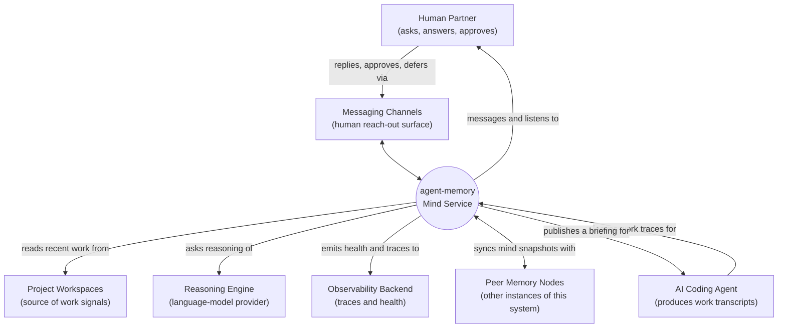
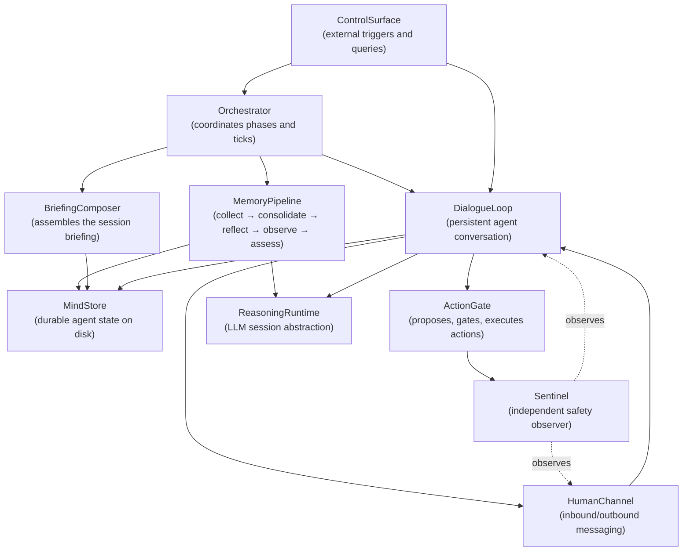

# Modeler 2 Proposal — System Context

**Target:** /Users/karl/Documents/dev/agent-memory
**Files sampled:** README.md, pyproject.toml, src/agent_memory/services.py, src/agent_memory/api.py, src/agent_memory/scheduler.py, src/agent_memory/agent_home.py, src/agent_memory/dialogue/agent.py, src/agent_memory/comm/router.py, src/agent_memory/guardian/agent.py, tests/unit/ (directory listing)

## 1. System purpose

agent-memory is a long-running companion service that gives an AI coding agent a durable mind: a memory it can write to, reflect on, and consult before each new working session. It watches the agent's day-to-day work, distills what happened into journals, summaries, beliefs, and self-assessments, and then composes that material into a focused briefing the agent reads at the start of any new task. It also lets the agent stay in conversation with its human partner between tasks — asking questions, proposing actions, and acting on approvals — while a second, independent observer keeps watch over what the agent is being told and what it is about to do.

## 2. Environment Diagram

**Question this diagram answers:** Who and what does this system interact with from the outside?

## 3. Conceptual Structure Diagram

**Question this diagram answers:** What are the main internal capabilities of this system and how do they fit together?

## 4. Conceptual Components

| Component | Responsibility (one line) | Roughly lives in |
|---|---|---|
| `ControlSurface` | Accepts external commands and questions and routes them inward. | `api.py`, `cli.py` |
| `Orchestrator` | Decides when each phase and tick runs and wires the rest together. | `scheduler.py`, `services.py` |
| `MemoryPipeline` | Turns raw work traces into journals, summaries, beliefs, and assessments. | `collection/`, `consolidation/`, `reflection/`, `observation/`, `assessment/`, `beliefs/` |
| `BriefingComposer` | Composes the curated session briefing the agent reads at start. | `retrieval/`, `preparation/` |
| `MindStore` | Owns the agent's on-disk mind layout and serves reads/writes to it. | `agent_home.py`, `selfwrite.py`, `state.py` |
| `DialogueLoop` | Runs the persistent agent conversation between ticks. | `dialogue/`, `heartbeat/` |
| `HumanChannel` | Carries messages to and from the human partner. | `comm/`, `mcp/` |
| `ActionGate` | Lets the agent propose actions and gates their execution behind approval. | `skills/` |
| `ReasoningRuntime` | Abstracts the underlying language-model session lifecycle. | `runtime/`, `llm/` |
| `Sentinel` | Independently observes content and proposed actions for safety. | `guardian/` |
