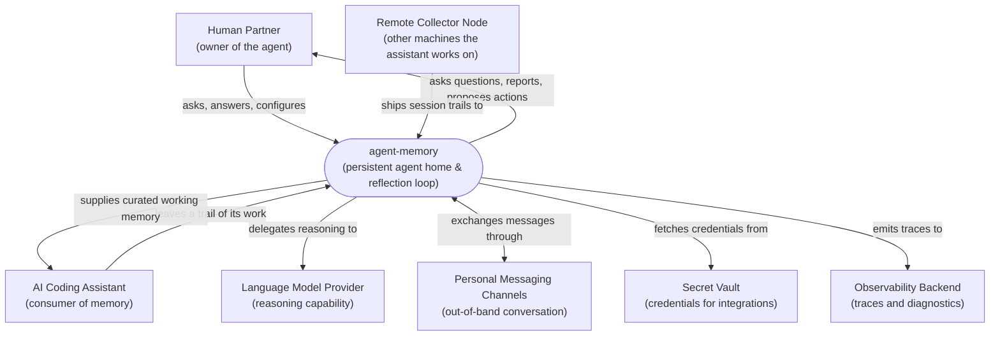
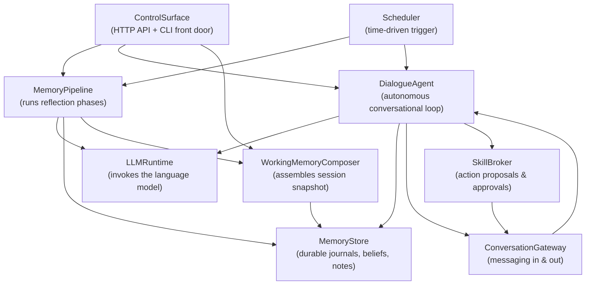

# Modeler 3 Proposal — System Context

**Target:** /Users/karl/Documents/dev/agent-memory
**Files sampled:** README.md, pyproject.toml, src/agent_memory/api.py, src/agent_memory/services.py, src/agent_memory/scheduler.py, src/agent_memory/agent_home.py, src/agent_memory/dialogue/agent.py, src/agent_memory/comm/router.py, src/agent_memory/collection (listing), src/agent_memory/retrieval (listing)

## 1. System purpose

agent-memory is a long-running companion service that gives an AI coding assistant a durable sense of self across sessions. It watches what the assistant did, distills that into journals, reflections, beliefs, and self-assessments, and assembles a concise working-memory document the assistant reads at the start of each new session. Alongside this background reflection loop, it hosts an autonomous dialogue partner that can chat with its human, ask clarifying questions, surface observations, and request approval before taking actions. The system is designed to run as a personal, always-on agent home for one human and one (or a small squad of) AI partners, with optional links out to messaging channels and remote collector nodes.

## 2. Environment Diagram

**Question this diagram answers:** Who and what does agent-memory interact with in its environment?

## 3. Conceptual Structure Diagram

**Question this diagram answers:** What are agent-memory's main internal parts and how do they relate?

## 4. Conceptual Components

| Component | Responsibility (one line) | Roughly lives in |
|---|---|---|
| `ControlSurface` | Exposes the system's capabilities to humans and tools via HTTP and a CLI | `src/agent_memory/api.py`, `src/agent_memory/cli.py` |
| `Scheduler` | Wakes the pipeline phases and the dialogue tick on cadences | `src/agent_memory/scheduler.py` |
| `MemoryPipeline` | Runs the collect/consolidate/reflect/observe/assess/dedup phases that turn raw activity into structured memory | `src/agent_memory/services.py`, `src/agent_memory/{collection,consolidation,reflection,observation,assessment,beliefs}/` |
| `MemoryStore` | Stores and resolves all durable agent content (journals, beliefs, notes, identity, dialogue state) | `src/agent_memory/agent_home.py`, on-disk agent home directory |
| `WorkingMemoryComposer` | Assembles the bounded, priority-ranked working-memory snapshot used at session start | `src/agent_memory/retrieval/`, `src/agent_memory/preparation/` |
| `DialogueAgent` | Maintains a persistent, autonomous conversational loop with the human partner | `src/agent_memory/dialogue/`, `src/agent_memory/heartbeat/` |
| `LLMRuntime` | Provides a uniform way to talk to whichever language model backs the agent today | `src/agent_memory/runtime/`, `src/agent_memory/llm/` |
| `Conversation` | Carries messages between the agent and the human across chat channels | `src/agent_memory/comm/`, `src/agent_memory/mcp/` |
| `SkillBroker` | Catalogs the actions the agent may take and gates them with proposals and approvals | `src/agent_memory/skills/` |
